{width="4.464444444444444in"
height="1.3666666666666667in"}

Workshop 1: Raspberry Pi and IoT
================================

Objective: 
===========

The purpose of this workshop is to get you started working with Bluemix,
Node-Red, Watson IoT, and a Raspberry Pi. You will be defining a
Raspberry Pi as an IoT device in the Watson IoT service. Following that,
you will use Node-Red to create an application on the Pi that reports
sensor information (temperature, humidity, barometric pressure, etc.) to
another Node-Red application running on Bluemix. Two sets of
instructions are provided. If you have prior experience and would like
to try and complete the exercise on your own, follow the Jedi Master
path. Otherwise, if you prefer a more guided approach, choose the Jedi
Padowan path. Choose wisely and have fun.

### Total time to complete: 1.5 - 2 Hours 

I.  Create the Bluemix Application Space (17 minutes)

II. Define IoT devices to Internet of Things Service (10 minutes)

III. Create dashDB table for environment data (8 minutes)

IV. Build Bluemix Node-Red flows (40 minutes)

V.  Connect to Raspberry Pi and Start Node-Red (5 minutes)

VI. Build Raspberry Pi Node-Red flows (40 minutes)

VII. Deploy and validate success (8 minutes)

***Note**: In the interest of time, it will be necessary to build the
Bluemix and Raspberry Pi Node-Red flows concurrently. One system will be
used to build the Bluemix portion, while another is used to build the
Raspberry Pi portion. During this time, all three team members should
work to oversee the overall project and provide each other guidance and
debugging support.*

Prerequisites:
==============

This workshop assumes that you have completed the STSA event
prerequisite activities. Specifically, you should have:

1.  An SSH terminal program for connecting to the Raspberry Pi. If you
    are using a MacOS or Linux based system, you are ready to go. If
    using Windows, you should have installed the PuTTY application
    available on the IBM Standard Software installer.

If you do not have these, please request assistance ASAP in order to get
your system prepared as you will not have time to complete the exercise.

*\
*

*Jedi Master Path:*
===================

### PART I: Create the Bluemix Application Space

-   Using one of your team’s Bluemix accounts, create a new Node-Red
    application from the Node-Red boilerplate. Instructions in these
    workshops assume that the name of the application is
    **STSAWorkshops-xx** (where xx is your team number).

-   Connect the following services to your new application. The names
    for the services are in parenthesis:

    -   Internet of things (**STSAWorkshops-IoT**)

    -   dashDB for Analytics (**STSAWorkshops-dashDB**)

### Part II: Define IoT devices to Internet of Things Service

-   In your newly created Internet of things service, device a new
    device type called **PiGateway**.

-   Add a new gateway device using the newly defined PiGateway device
    type. For these workshop exercises, the device ID is assumed to be:
    **STSAGateway**.

> ***Note**: The workshops will be treating the Raspberry Pi as a
> Gateway and the attached Sense Hat as a downstream sensor device.
> However, it is not necessary to define the Sense Hat device to the IoT
> service as the gateway device will do it for you you when the Sense
> Hat connects through it.*

### Part III: Create dashDB table for environment data

-   Add a new table to your dashDB service using the following DDL:

    CREATE TABLE "SENSEDATA"

    (

    "SENSORID" VARCHAR(20),

    "TEMPERATURE" DOUBLE,

    "HUMIDITY" DOUBLE,

    "PRESSURE" DOUBLE,

    "TIMESENT" TIMESTAMP

    );

    ***Note**: The name of this table and the names of the rows will be
    an important element of later workshops so be sure to double check
    your spelling.*

### PART IV: Create Bluemix Node-Red Flows

-   Create the following:\
    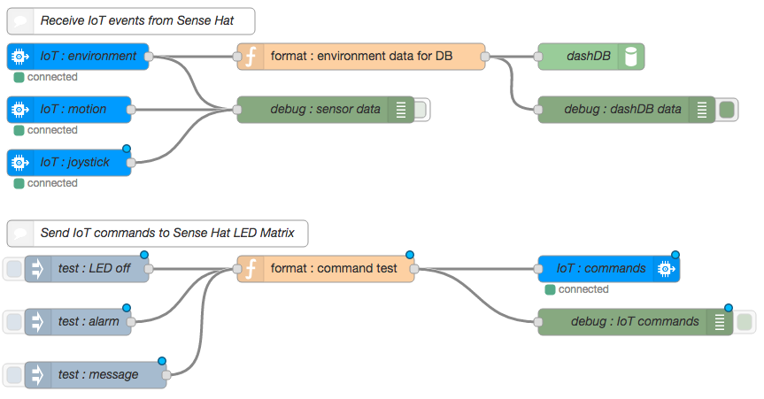{width="7.0in" height="3.6416666666666666in"}

-   Receive the three different event types (environment, motion, &
    joystick).

-   Format the incoming **environment** data into the appropriate format
    for the dashDB node.

> *The incoming environment event will have the following payload*:
>
> msg.payload: {d:{temperature: 35.21\
> humidity: 38.31\
> pressure: 994.84}}\
> *\
> The dashDB node will need the following payload based upon the table
> created earlier*:
>
> msg.payload: {SENSORID : deviceId,\
> TEMPERATURE : temperature,\
> HUMIDITY : humidity,\
> PRESSURE : pressure,\
> TIMESENT : 'TIMESTAMP'}

-   Send test commands called **alarm** and **message** to the Sense Hat
    device on the Raspberry Pi. The three inject nodes should send a
    string payload with a topic that identifies the specific command
    being sent as follows:

  **Type**   **Payload**                       **Topic**   **Name**
  ---------- --------------------------------- ----------- --------------
  string     off                               alarm       Turn off LED
  string     green                             alarm       Green
  string     red                               alarm       Red
  string     enter any message you like here   message     Send Message

> ***Note:** You will be using the Red and Green buttons to provide
> answers to questions over the course of the event.*

-   Set the outbound msg.eventOrCommandType to either alarm or message
    based upon the incoming topic type.

-   Format the injected data into the appropriate format for the
    Raspberry Pi application based upon the incoming topic type:

> *The alarm command will need to have the following payload*:
>
> msg.payload: {d:{color:”desired color or off”}}
>
> *The message command will need to have the following pay*load:
>
> msg.payload: {d:{color:”desired color”,\
> background:”desired color”,\
> message:”desired message”}}

### PART V: Start Node-Red on Raspberry Pi

1.  Apply power to your Raspberry Pi by attaching a standard microUSB
    cable between a laptop and the microUSB connector on the Raspberry
    Pi (booting takes less than a minute).

2.  Connect to your Raspberry Pi using SSH. Your Pi can be reached at IP
    address 192.168.32.xx. Replace the xx with your specific team
    number. For example, team 30 would use:\
    **ssh pi@192.168.32.30** (pi is the username)

3.  The Raspberry Pi credential are:\
    User ID: pi\
    Password: raspberry

4.  In order to ensure that node-red will restart automatically in the
    event of reboots and crashes, you should enable the nodered service
    with the command:\
    sudo systemctl enable nodered.service

5.  Finally, start Node-Red on the Pi with the command: node-red-start

> ***FYI**: When the Node-Red app starts, the last action it performs is
> to start a logging function. You can exit this logging, if needed, by
> pressing Ctrl-c. This will not stop Node-Red itself. If/When you want
> to stop Node-Red, you need to issue the command: node-red-stop.*

### Part VI: Create Raspberry Pi Node-Red Flows

-   Create the following:\
    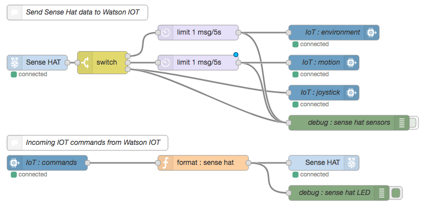{width="7.0in" height="3.4791666666666665in"}

-   Break the Sense Hat sensor data into three different event types
    (environment, motion, & joystick).

-   Limit the number of environment and motion events that are sent to
    the IoT nodes to 1 every 5 seconds. Otherwise you will quickly
    overwhelm the data transfer limits imposed by our free IoT Service
    accounts.

-   Send the data to the IoT service as one of three event types.

-   Receive incoming IoT commands called **alarm** and **message**. The
    alarm command should light the entire 8x8 LED matrix on the Sense
    Hat to a solid color provided in the incoming IoT command. The
    message command should scroll a message across the LED matrix. The
    message, the text color, and the background color are all provided
    in the incoming IoT command.

-   Format the incoming command data into the appropriate format for the
    Sense Hat node.\
    *The incoming alarm command will have the following payload*:

> msg.command: "alarm"\
> msg.format: "json"\
> msg.deviceType: "SenseHat"\
> msg.deviceId: "sensehat-xx”\
> msg.payload: {d:{color:msg.payload}}
>
> *The incoming message command will have the following payload:*
>
> msg.command: "message"\
> msg.format: "json"\
> msg.deviceType: "SenseHat"\
> msg.deviceId: "sensehat-xx”\
> msg.payload: {d:{color:"blue",\
> background:"green",\
> message:”message text”}}
>
> *In order to set the entire 8x8 Sense Hat LED matrix to a specific
> color, you need to have the following string in the msg.payload*:
>
> msg.payload = “\*, \*, *color*” (replacing *color* with a color choice
> like red, blue, green, etc)
>
> *To have a message scroll across the LED matrix, the msg format is a
> bit more detailed*:
>
> msg.color = “*color*” (again, replacing *color* with a color choice
> like red, blue, green, etc)\
> msg.background = “*color*” (again, replacing *color* with a color
> choice like red, blue, green, etc)\
> msg.payload = “message to display”

### Part VII: Deploy and validate success

-   Please skip ahead to the common Part VII Section.

*\
*

*Jedi Padowan Path*
===================

In order to ensure that everyone get valuable experience with creating
Bluemix applications and services, please complete parts I – III
together as a team. After part III, development will proceed
concurrently. One system will be used to complete part IV, while another
is used to complete parts V & VI. The team will again work together to
complete part VII – Validation and test.

### PART I: Create the Bluemix Application Space

Here we will create the Bluemix side of the application. This will be a
Node-Red application that will receive sensor events from, and send
commands to a Raspberry Pi. We will start with a Node-Red boilerplate
application and connect the IoT, Watson Conversation, and dashDB
services to it.

1.  Open a browser and sign in to one of your team’s Bluemix accounts at
    [**www.bluemix.net**](http://www.bluemix.net). You will be using
    only one of your Bluemix accounts for this workshop.

2.  From here, click on:
    {width="0.9451388888888889in"
    height="0.2835422134733158in"} and navigate to and click on:
    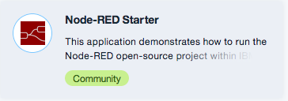{width="1.4938724846894138in"
    height="0.5253182414698163in"}.\
    You can use the type-ahead feature of the search bar to quickly find
    this boilerplate.

3.  On the resulting screen, you need to give your application a name.
    You can name you application anything you like provided it is
    unique. For consistency, these workshops will use the name
    **STSAWorkshops-xx** **(Replace xx with your team number)**. Enter
    your application name in the application name field, and click
    {width="0.9171369203849519in"
    height="0.20438976377952756in"}. There is no need to modify any of
    the other fields on this page. At this point, your application will
    be created and, after a few moments, you will be taken to the
    Getting Started page for your application.

4.  As you work through the workshops over the new 2 days, you will need
    connections to additional services in your application. Let’s make
    those connections now. Go to the **Connections menu** of your
    application page. ***Note**: As part of the boilerplate, a Cloudant
    NoSQL database has been created automatically. You will add two
    additional services: **Internet of Things and dashDB for
    Analytics**.*

5.  Click {width="1.0264227909011374in"
    height="0.33679461942257216in"} and select the
    {width="1.7203346456692914in"
    height="0.6123206474190727in"}.\
    Again, you can use the type-ahead feature of the search bar to find
    this service quickly.\
    **Important: Make sure that you select the IoT Platform Service, not
    the IoT Platform Boilerplate app.**

6.  You will need to give your IoT service a name. A default name is
    suggested but may be typed over. While it can name the service
    anything you like, the instructions throughout will assume a name of
    **STSAWorkshops-IoT** for the IoT service.

7.  Next, you need to tell this new service what application to connect
    to. On the left side of the page, you will see the connect to
    drop-down menu. Be sure to select your Bluemix application from this
    list.\
    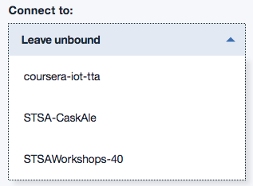{width="1.632638888888889in"
    height="1.205165135608049in"}

8.  Click {width="0.9171369203849519in"
    height="0.20438976377952756in"} and, after a moment, you will be
    asked to restage the application. Say **yes** to the restaging
    request. At this point you have created a new IoT service and
    connected it you your application.

9.  Repeat steps 4 - 8 to add the **STSAWorkshops-dashDB** services to
    your application using the following service.\
    {width="2.128953412073491in"
    height="0.7510465879265091in"}

10. At this point, you should be in the Connections section of your
    application. Click on Overview in order to return to the Overview
    page which should look similar to this:\
    {width="4.764583333333333in"
    height="4.034297900262467in"}

### PART II: Define IoT devices to Internet of Things Service

1.  At this point you should be in the “Overview” section of your
    Bluemix application. If you are not, simply click on your
    application name (**STSAWorkshops-xx**) in the Bluemix dashboard.

2.  Scroll down to the:\
    {width="2.576266404199475in"
    height="1.3980336832895888in"}\
    And click on the **STSAWorkshops-IoT** service to start it.

3.  This will land you on the “Manage” page of your IoT service where
    you should click
    {width="0.6728116797900262in"
    height="0.25077646544181975in"}. ***Note**: The IoT service should
    then launch in a separate browser window or tab leaving the service
    details tab open as well. Keep this tab open as it will make
    returning to the Bluemix dashboard much easier.*

4.  You will need to create a new IoT device. On the Left side of the
    window, you should see an icon that looks like
    this:{width="0.32242016622922137in"
    height="0.2848042432195976in"}. Click on this icon to get to the
    devices view.\
    ***Note**: These workshops will be treating the Raspberry Pi as a
    Gateway and the attached Sense Hat as a downstream sensor device.
    However, it is not necessary to define the Sense Hat device to the
    IoT service as the gateway device will do it for you when the Sense
    Hat connects through it.*

5.  Click new on the
    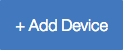{width="0.6792071303587052in"
    height="0.27387357830271214in"}.

6.  The first step of device creation is to select the device type.
    There is a drop-down menu to select from but you will notice that
    there are no device types in the list. So, we will create the device
    type as a part of the device creation by selecting
    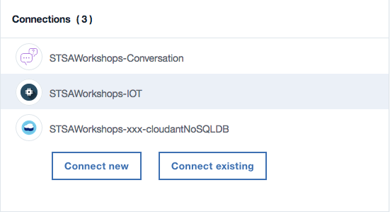{width="2.1465277777777776in"
    height="0.2633781714785652in"}.

7.  We will be configuring the Raspberry Pi as a Gateway device select
    {width="2.1465277777777776in"
    height="0.2509787839020122in"}.

8.  Call the new device type **PiGateway** and give it any description
    you like.

9.  Then, in the lower right corner, find and select the
    {width="0.35363517060367455in"
    height="0.23039916885389328in"} button.

10. At this point, you arrive at the “Define Template” page. The options
    on this page select attributes for the device type. All of these
    attributes are optional. They will be used as a template for new
    devices that are assigned this device type. Attributes you do not
    define may still be edited individually on devices that are assigned
    this device type. We will not define any additional attributes, so
    just click {width="0.35363517060367455in"
    height="0.23039916885389328in"}.

11. Next, you come to the “Submit Information” page. If you had selected
    any attributes in the prior page, they would be listed here for
    verification. Select
    {width="0.35363517060367455in"
    height="0.23039916885389328in"} again to proceed to the “Metadata”
    page.

12. The “Metadata” page is where you would define any custom attributes
    that might be needed for your environment. We have no need for any
    Metadata so just click
    {width="0.38958333333333334in"
    height="0.22522747156605424in"} to create the new PiGateway device
    type.

13. Now you will be returned to the “Add Device” page. However, now you
    will see the new device type “PiGateway” in the list of device
    types. Go ahead and select it and click
    {width="0.35363517060367455in"
    height="0.23039916885389328in"}.

14. Every device needs to have a unique id within your specific IoT
    service instance and it is defined on this Device Info page. You can
    use any unique name that you like, these workshops assume the device
    id is: **STSAGateway**. Enter your device id and click
    {width="0.35363517060367455in"
    height="0.23039916885389328in"}.\
    ***Note**: There are also several other attributes that can be
    defined here that can help you to identify a device and its purpose.
    These can be very useful in a multi device environment but, since we
    will only be dealing with a gateway and a downstream sensor, these
    additional attributes won’t be needed.*

15. Just as it was during Device Type creation, the “Metadata” page is
    where you would define any custom attributes that might be needed
    for your environment. We have no need for any metadata so just click
    {width="0.35363517060367455in"
    height="0.23039916885389328in"} to move to the “Security” page.

16. Regarding security, there are two options. The Auto-generated token
    is a random 18 character mix of alphanumeric characters and symbols.
    The other option is a Self-provided token where you provide your own
    authentication token for the device. While in the real world,
    security is paramount, for these workshops, please scroll down and
    enter an easily remembered, **self-provided** token (we will use
    **raspberry**) and then click
    {width="0.35363517060367455in"
    height="0.23039916885389328in"}.\
    ***Note**: Authentication tokens are encrypted and cannot be
    recovered if lost. Be sure to make a note of your token. *

17. Finally, you come to the “Summary” page where you can verify all of
    your entries before you complete the device creation by clicking
    {width="0.3279002624671916in"
    height="0.20178477690288715in"}.

18. Your device is now defined and you are presented a summary page of
    the result. Make a note of the following items from the summary page
    as you will need them later when you actually connect your device to
    the IoT service.\
    \
    Organization ID: \_\_\_\_\_\_\_\_\_\_\_\_\_\_\_\
    \
    Device Type: \_\_\_\_\_\_\_\_\_\_\_\_\_\_\_\
    \
    Device ID: \_\_\_\_\_\_\_\_\_\_\_\_\_\_\_\
    \
    Token: \_\_\_\_\_\_\_\_\_\_\_\_\_\_\_

19. Close the summary window by clicking
    {width="0.2630194663167104in"
    height="0.2356211723534558in"} and you will be taken back to the
    device dashboard where you will see your new device. You should
    leave this browser tab open for validation testing later, but, for
    now, switch over to the IoT Service Details browser tab so you can
    return to your Bluemix dashboard.

20. In order to return to the Bluemix Dashboard, click the hamburger
    menu in the upper left of the page, select **Services** then
    **Dashboard**.\
    {width="0.3135247156605424in"
    height="0.25604549431321083in"}\
    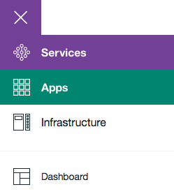{width="1.30625in"
    height="1.458383639545057in"}

### Part III: Create dashDB table for environment data

At this point, we will create a table in your dashDB service to hold the
environment data that is sent to your application from the IoT sensors.
This will be a fairly simple table that will store the Temperature,
Humidity, and Barometric Pressure values into a row of the table each
time an environment event is received. We will also store the ID of the
sensor that sent the data along with a time stamp.

1.  To get started, find the **STSAWorkshops-dashDB** Service in your
    Bluemix dashboard and click on it to launch the service.

2.  Like the IoT Service, this will land you on the “Manage” page of
    your dashDB service where you should click
    {width="0.5838156167979003in"
    height="0.21331692913385827in"}.\
    ***Note**: The dashDB service should then launch in a separate
    browser window or tab leaving the service details tab open as well.
    Keep this tab open as it will make returning to the Bluemix
    dashboard much easier.*

3.  Click on {width="0.8004943132108486in"
    height="0.721165791776028in"}and then
    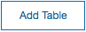{width="0.6558880139982503in"
    height="0.25018372703412073in"}in order to create a new table.

4.  Replace the text in the “Edit the DDL statements box with the
    following:

    CREATE TABLE "SENSEDATA"

    (

    "SENSORID" VARCHAR(20),

    "TEMPERATURE" DOUBLE,

    "HUMIDITY" DOUBLE,

    "PRESSURE" DOUBLE,

    "TIMESENT" TIMESTAMP

    );

    ***Note**: The name of this table and the names of the rows will be
    an important element of later workshops so be sure to double check
    your spelling.*

5.  Click {width="0.62750656167979in"
    height="0.2649475065616798in"}and your table will be created. You
    should see a message that the table was created successfully.
    Dismiss that message and you will be returned to the “Create a
    Table” page. Dismiss that as well and you will be back to the
    “Create, drop, and work with tables” page.

6.  Select the “SENSEDATA” table from the table name drop
    down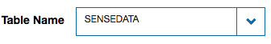{width="1.7609601924759406in"
    height="0.288251312335958in"}and you will be able to see the table
    definition. You can also click on “Browse Data” in order to see the
    actual data stored in the table. This will be handy later.\
    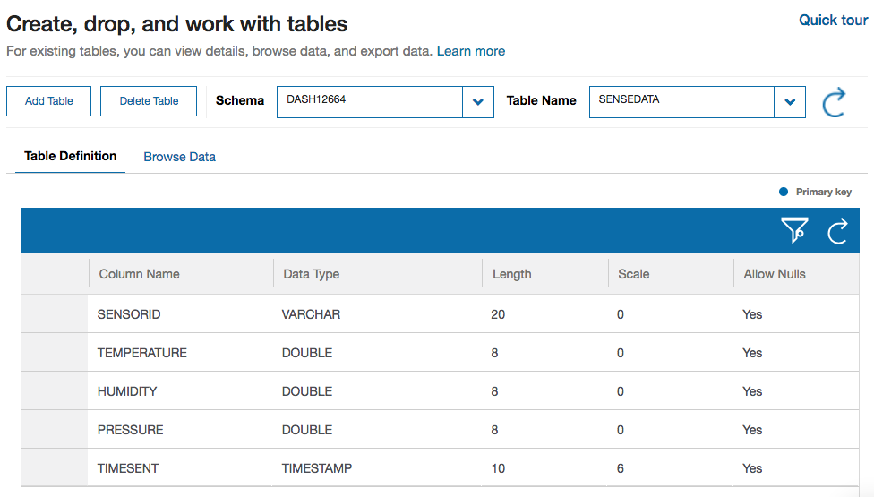{width="5.539805336832896in"
    height="3.150213254593176in"}

7.  You should leave this browser tab open for validation testing later,
    but, for now, switch over to the dashDB Service Details browser tab
    so you can return to your Bluemix dashboard.

8.  In order to return to the Bluemix Dashboard, click the hamburger
    menu in the upper left of the page, select **Apps** then
    **Dashboard**.\
    {width="0.3135247156605424in"
    height="0.25604549431321083in"}\
    {width="1.30625in"
    height="1.458383639545057in"}

At this point, you should split development tasks. One should continue with part IV, while another completes parts V & VI.
--------------------------------------------------------------------------------------------------------------------------

### Part IV: Create Bluemix Node-Red Flows

In this portion of the workshop you will create a Node-Red application
on Bluemix that will receive sensor data sent to it from a corresponding
application on the Raspberry Pi. You will then store some of that data
in your dashDB Service so that it can be used in later workshops. There
are three different types (environment, motion, & joystick) of sensor
data that will be received. You will only store the environment data in
the database. Additionally, this application will be able to send
commands to the Raspberry Pi application that will control the 8x8 LED
matrix that is part of the Sense Hat device. One command (alarm) will
turn the entire matrix into a solid color that is provided as a part of
the message payload. The other command (message) will scroll a text
message across the matrix. The message, the text color, and the
background color will all be provided as a part of the message payload.
Ready? Let’s begin.

#### *Flow 1*

1.  Node-Red programming is done via web browser. In order to get
    started, select your application from the Bluemix Dashboard.

2.  From there, you get to the Node-Red programming space, by selecting
    **Visit App
    URL**{width="2.9825404636920383in"
    height="0.5089249781277341in"}

3.  The first time that you start the Node-Red environment, you will be
    presented with a Welcome wizard. Use the Next button to progress
    through the wizard. You will be asked to set a Username and Password
    that will help to secure your Node-Red space. You can choose to
    bypass this, but you really should add the Username and Password. Be
    sure to remember them, otherwise you will lose all of your work in
    the editor. While not normally good practice, make a note of them
    here:

> Username: \_\_\_\_\_\_\_\_\_\_\_\_\_\_\_\_\_
>
> Password: \_\_\_\_\_\_\_\_\_\_\_\_\_\_\_\_\_
>
> The next part of the wizard is an opportunity to browse some Node-Red
> nodes that might be useful. In the interest of time, just press next
> here to complete the wizard.

1.  Once the first-time wizard is complete, you are taken to the
    Node-Red launch page and can start the editor by clicking:
    {width="1.4034722222222222in"
    height="0.3697528433945757in"}.

2.  From the node palette on the left, find the
    {width="1.2410181539807523in"
    height="0.34266951006124236in"}input node (it should be located in
    the input section of the palette) and drag it out into your Node-Red
    workspace.

3.  The ibmiot input node will receive the events that are sent from the
    Raspberry Pi application. You will need to configure the node by
    double-clicking on it to open its settings panel.

-   {width="3.61875in"
    height="2.959722222222222in"}Because the IoT service is connected to
    your application, all the authentication can be handled right
    through Bluemix and no other information needs to be provided for
    authentication.

<!-- -->

-   Set this node to accept events from all Device Types and Device Ids.
    ***Note**: You can get restrictive and only accept events from
    specific IDs and types if desired.*

-   This node should only accept events of type **environment**.

1.  Now, add two more ibmiot nodes below the current one that will
    handle the **motion** and **joystick** events respectively.

2.  Next, find and add a
    {width="1.2506944444444446in"
    height="0.3335181539807524in"} node (In the output section) to the
    right of the ibmiot nodes.

3.  Open the debug node settings and change the output to **complete msg
    object**. This will allow you to view the entire msg being received
    by the prior node. It can be very useful in helping to format the
    msg that needs to be sent to the next node.

4.  Connect your ibmiot nodes to your debug node by clicking and
    dragging from one connection point to the other
    {width="0.5235444006999125in"
    height="0.2981288276465442in"}. ***Note**: You can have several
    nodes connecting to a single connection point.*

5.  Once the Raspberry Pi side of this application is complete, you will
    be able to verify that you are receiving events from the Raspberry
    Pi by clicking {width="1.0893383639545058in"
    height="0.2614413823272091in"}.

6.  On the right side of the page you should see a tab labeled “debug”.
    Click on that tab and you should see data flowing into your debug
    node from the ibmiot nodes. If the Raspberry Pi side of this
    application is up and running

7.  On the right side of the debug node you will see a green toggle
    button 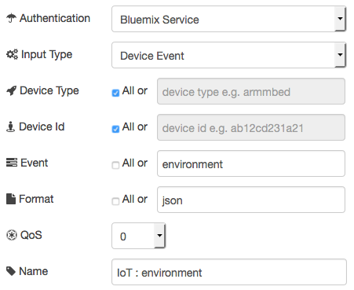{width="0.5203937007874015in"
    height="0.3171150481189851in"}. This allows you to stop/start the
    output to that particular debug node. Turn off the output by
    clicking the toggle and the data will stop coming into the debug
    panel. Now you can get a closer look at the actual event messages
    that are being received as they won’t continually scroll by. If the
    Raspberry Pi side of this application is up and running, you should
    take a minute to examine the debug output. You will see that each
    message has a payload. Notice that each message will have an event
    type that matches one of the three events that the Raspberry Pi
    forwards (environment, motion, & joystick). ***Note**: You can flush
    the contents of the debug tab by clicking the trash can in the upper
    right corner.*

8.  Now you will store the incoming environment event data into your
    dashDB table. First you will need to put the incoming data into the
    correct format for the database. You will do that with a
    **function** node. To get started, add a **function** node (function
    section) to your workspace and connect it to the right side of the
    **IoT environment** node. ***Note**: the function node has
    connectors on both the left and right side. The function node is
    designed to take an incoming message (left side), modify it in some
    way, and then send the message along its way using the output (right
    side) connector.*

9.  The function node is a powerful node that allows you to incorporate
    your own program logic into a Node-Red application. The message is
    passed in to the function node as a JavaScript object called msg. By
    convention it will have a msg.payload property containing the body
    of the message. You can act on the content of this payload, modify
    it, and pass it along to the next node in your application. The
    function node in this flow will receive the message from the IoT
    service and put it into the format that the dashDB expects. The
    msg.payload for the dashDB node should include a value for each
    column in your table. To make this happen, open the function node
    and enter the following code into the function field of the function
    node to transform the incoming Sense Hat data into that which is
    expected by dashDB.

> // Format Sensor Data for dashDB\
> msg.payload = {\
> SENSORID : msg.deviceId,\
> TEMPERATURE : msg.payload.d.temperature,\
> HUMIDITY : msg.payload.d.humidity,\
> PRESSURE : msg.payload.d.pressure,\
> TIMESENT : 'TIMESTAMP'\
> };\
> return msg;

1.  Drag another debug node into the workspace and connect it to the
    right side of the function node.

2.  Deploy the app and, if the Raspberry Pi side of this application is
    up and running, verify that the output from your function node
    appears correct by examining the payload output in the debug tab.
    Otherwise, keep moving forward and you can verify the data flow
    later.

3.  Once the data is being formatted properly, it’s time to store it
    into your database. Find a **dashDB** output node (storage) and
    connect it to the right side of the function node. ***Note**: There
    are two dashDB node types and they look very similar. Be sure to
    select the output node. It is the one that has only one connector
    located on the left side. *

4.  Edit the dashDB node by selecting your database service from the
    drop-down list and specifying the table name of **SENSEDATA**.

5.  Deploy the application and your environment data will now be stored
    into the SENSEDATA table. Each row of the table will correspond to
    an incoming environment event.

6.  This concludes flow 1.

#### *Flow 2*

1.  The second flow will inject test data that will be sent to the Sense
    Hat device to control the LED. In order to build the second flow,
    you will need seven nodes. Four **inject** nodes will connect to a
    **function** node, which in turn will connect to both a **ibmiot**
    output node, and a **debug** node. In some space below your first
    flow, drag these nodes into your workspace and connect them as
    described.

2.  Like before, set the debug node to show the **complete msg object**.

3.  The four inject nodes will be used to trigger messages that will
    control the LED from your Bluemix application. Pressing the button
    on the left side of the inject node allows a message on a topic to
    be injected into the flow. You will use the topic field to identify
    the type of command (alarm or message) you wish to send. The payload
    should be a string that will be sent on to the function node. The
    string will differ for each node. The inject nodes should look as
    follows:

  **Type**   **Payload**                       **Topic**   **Name**
  ---------- --------------------------------- ----------- --------------
  string     off                               alarm       Turn off LED
  string     green                             alarm       Green
  string     red                               alarm       Red
  string     Enter any message you like here   message     Send Message

> ***Note:** You will be using the Red and Green buttons to provide
> answers to questions over the course of the event.*

1.  Now let’s move on to the function node. As you now already have
    experience with the function node, enter the following code snippet
    into your new function node. This code will create the appropriate
    java script object (d) that needs to be sent, depending on the topic
    type. The incoming msg.payload will be used as input to the object
    creation. ***Note**: The message command has two additional
    parameters, color and background. You can set them as you prefer in
    this code snippet*.

> // begin code\
> msg.eventOrCommandType = msg.topic;\
> if (msg.topic == "alarm") {\
> msg.payload={d:{color:msg.payload}};\
> }\
> else if (msg.topic == "message") {\
> msg.payload={d:{color:"navy",\
> background:"black",\
> message:msg.payload}};\
> }\
> else\
> msg = null;\
> return msg;\
> // end code
>
> Note: Feel free to substitute any color you like for the color and
> background.

1.  All that is left is to configure the ibmiot output node:

-   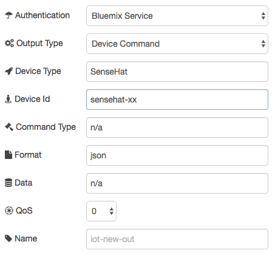{width="3.2069444444444444in"
    height="2.986111111111111in"}The configuration of this node is very
    similar to the ibmiot input node.

    -   The output type in this case is a device command as opposed to a
        device event. We are sending a command to the device rather than
        responding to an event.

    -   The command type and the data are being provided in the payload
        of the prior node. As such, these fields will be ignored here.
        Put anything you like to indicate this.

1.  With that, the Bluemix side of this application is complete. Click
    on **Deploy** to start the application. Once the Raspberry Pi side
    is complete, you will be able to test the flows and ensure that
    everything is working as expected. Part VII of this workshop has
    some verification tests you can use.

2.  In the end, your Bluemix application should look something like
    this:\
    {width="7.0in" height="3.6416666666666666in"}

### PART V: Start Node-Red on Raspberry Pi

1.  In order to get started with the Raspberry Pi, you first need to
    apply power to the device. To do this, attach a standard microUSB
    cable between a laptop and the microUSB connector on the Raspberry
    Pi (booting takes less than a minute).

2.  Now it is time to connect to the Raspberry Pi with a secure shell
    (ssh). The instructions are slightly different depending on your
    laptop OS

*Mac OS*:

1.  Start the Terminal application from the Mac OS Launchpad.

2.  Issue the command: **ssh pi@192.168.32.xx** (replace the xx with
    your team specific team number). For example, team 30 would use:
    **ssh pi@192.168.32.30** (pi is the username)**\
    *Note: ****When you connect for the first time, you may see a
    message indicating that the authenticity of the host could not be
    established. Simply answer with “yes”.*

*Windows*:

1.  Start the PuTTY application from the Windows start menu.

2.  Enter **pi@192.168.32.xx** (replace the xx with your team specific
    team number). For example, team 30 would use: **ssh
    pi@192.168.32.30** (pi is the username)

3.  Click “Open”.\
    ***Note:** When you connect for the first time, you may see a
    message indicating that the authenticity of the host could not be
    established. Simply answer with “yes”.*

*Everyone*:

1.  At this point, you will be prompted for the user password. The
    Raspberry Pi credentials are:\
    User ID: **pi**\
    Password: **raspberry**\
    ***Note:** Once logged in, you will see a message reminding you to
    change the password of your Pi. Use the **passwd** command to change
    it in order to ensure the security of your work. Be sure to make a
    note of your new password. *

2.  In order to ensure that node-red will restart automatically in the
    event of reboots and crashes, you should enable the nodered service
    with the command:\
    sudo systemctl enable nodered.service

3.  Finally, start Node-Red on the Pi with the command: node-red-start\
    ***FYI**: When the Node-Red app starts on the Pi, the last action it
    performs is to start a logging function. You can exit this logging,
    if needed, by pressing Ctrl-c. This will not stop Node-Red itself.
    If/When you want to stop Node-Red, you need to issue the command:
    node-red-stop.*

### Part VI: Create Raspberry Pi Node-Red Flows

In this portion of the workshop you will create a Node-Red application
on the Raspberry Pi that will collect sensor data from a device called a
Sense Hat that is attached to the Pi. You will then forward that data to
your IoT Service so that it can be used by a corresponding Node-Red
application you will create in Bluemix. There are three different types
(environment, motion, & joystick) of sensor data and each type will be
sent to the IoT service with a specific event type so that different
actions might be taken depending on the event type. Additionally, this
application will be able to receive commands sent from the Bluemix
application that will control the 8x8 LED matrix that is part of the
Sense Hat device. One command (alarm) will turn the entire matrix into a
solid color that is provided as a part of the message payload. The other
command (message) will scroll a text message across the matrix. The
message, the text color, and the background color will all be provided
as a part of the message payload. Ready? Let’s begin.

#### ***Flow 1***

1.  Node-Red programming is done via web browser. In order to get
    started, fire up one of your team’s laptop browsers and enter
    **192.168.32.xx:1880** (Replace the xx with your team specific team
    number. For example, team 30 would use: **192.168.32.30:1880**) into
    the address field.\
    ***Note**: When you started Node-Red on the Pi, you may have noticed
    that is said to go to 127.0.0.1:1880. This would work if you were
    running the browser on the Pi itself (There is actually a full GUI
    environment available on the Pi and you can run a browser locally).
    However, because you are connecting to the Pi remotely, you need to
    use the network address of your team’s system.*

2.  From the node palette on the left, find the
    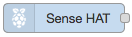{width="1.161984908136483in"
    height="0.3257075678040245in"}input node (it should be located in
    the Raspberry\_Pi section of the palette) and drag it out into your
    Node-Red workspace.

3.  Double click on the new Sense Hat node to open its settings and
    ensure that all three event types are being reported by checking
    each box.

4.  Next, find and add a
    {width="1.2506944444444446in"
    height="0.3335181539807524in"} node (In the output section) to the
    right of the Sense Hat node.

5.  Open the debug node and change the output to **complete msg
    object**. This will allow you to view the entire msg being received
    by the prior node. It can be very useful in helping to format the
    msg that needs to be sent to the next node.

6.  Connect your Sense Hat node to your debug node by clicking and
    dragging from one connection point to the other
    {width="0.5235444006999125in"
    height="0.2981288276465442in"}.

7.  At this point, verify that your Sense Hat is producing output by
    clicking {width="1.0466458880139982in"
    height="0.2511953193350831in"}.

8.  On the right side of the page you should see a tab labeled “debug”.
    Click on that tab and you should see a tremendous amount of data
    flowing into your debug node from the Sense Hat.

9.  On the right side of the debug node you will see a green toggle
    button {width="0.5203937007874015in"
    height="0.3171150481189851in"}. This allows you to stop/start the
    output to that particular debug node. Turn off the output by
    clicking the toggle and the data will stop scrolling by in the debug
    panel. Now you can get a closer look at the actual messages that the
    Sense Hat is sending. Take a minute to examine the debug output. You
    will see that each Sense Hat message has a topic and a payload.
    Notice that the topic will match one of the three data types that
    the Sense Hat reports (environment, motion, & joystick). In order to
    perform different actions on the different sensor topics, we will
    need to separate them into unique events.

10. Find the **switch** node (function section) and add it to your
    workspace to the right of your Sense Hat node.

11. Connect the switch node to the Sense Hat node. ***Note**: the switch
    node has connectors on both the left and right side. The switch node
    is designed to take an incoming message (left side) and route the
    application flow to different paths based upon the value of some
    element of the incoming messge. It will then send the message along
    its way using the output (right side) connector.*

12. Open the settings for the switch node and set the property value to
    **msg.topic**. The contents of msg.topic is what will be used to
    branch application flow. Below the Property value is an area in
    which you can specify what you want to compare the Property to. This
    application will need to route its flow based upon whether the
    msg.topic is equal (==) to “environment”, “motion”, or “joystick”.

13. Click the drop-down menu beside the == in order to get an idea of
    the possible comparison operations that can be performed. Leave the
    value set to **==.**

14. To the right of that is a field where you specify the actual value
    you will compare to. There is also a drop-down here that allows you
    to specify what type of data is being compared. Ensure that
    **String** is selected and then enter the string **environment**
    into the field.

15. Use the 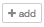{width="0.4222889326334208in"
    height="0.25913167104111984in"} button near the bottom to add the
    additional comparison fields for **motion** and **joystick**.

***Note**: When you close the switch node settings, you will now see
three separate connection points on the output side of the switch node.
This is what allows you to route the flow based on the results of the
comparison. The connection points are in the same order as they were
added to the switch node.*

1.  One thing that you may have noticed when viewing the debug output is
    that there are a lot of events being generated by both the
    environment and the motion topics. If you were to send every one of
    these events to the IoT service, you would quickly use up the 200MB
    data limit that is imposed on a free IoT service. This is also a
    consideration for your clients as the IoT service does have a charge
    that is based upon data transmission. To deal with this, add and
    connect **delay** nodes to the environment and motion outputs of the
    switch node.

2.  For each delay node, open the settings and set the action to **Limit
    rate to.**

3.  Limit the rate to 1 message every 5 seconds and check the box to
    **drop intermediate messages**. This will cause the application to
    discard all messages except for one every 5 seconds.

4.  Now, let’s move the debug node from the Sense Hat over to the output
    of the switch/delay nodes. First, delete the connection between the
    Sense Hat node and the debug node by clicking on the line connecting
    them and then hitting the delete key.

5.  Now, connect the output of the two delay nodes and the final switch
    connection (joystick topic) to the debug node. ***Note:** You can
    have several nodes connecting to a single connection point on
    another node.*

6.  Redeploy the application by once again clicking deploy and you
    should see a dramatic decrease in the number of messages received.
    ***Note**: You will only see joystick topics when you actually use
    the Sense Hat joystick. For that reason, there is no need to delay
    them like the other topics.*

7.  Finally, it is time to send these messages to your IoT Service so
    that they can be accessed from your Bluemix application. For this,
    you will need to pull three **Watson IoT** output nodes into your
    workspace and position them to the right of your delay nodes.

8.  Each Watson IoT node will send a separate event type to the IoT
    service. You will need to configure them by opening settings and
    configuring as follows:

-   {width="3.4895833333333335in"
    height="3.229861111111111in"}Because we defined the Raspberry Pi as
    a Gateway device, you need to connect as a **Gateway**.

-   When configuring the first of these nodes, you will need to **Add
    new wiotp-credentials.** You do this by clicking on the
    {width="0.3332436570428696in"
    height="0.3332436570428696in"} in the credentials line. Here you
    will identify the gateway device that you defined earlier. Use the
    values that you recorded during the IoT device definition to fill in
    the appropriate fields. Do not modify any other fields in this
    section.

-   The device type and Device ID can be any value that helps to
    identify their purpose. We will use the values provided for
    consistency.

-   The value entered into Event type will define the actual event that
    this message comprises. Use one of the three values in each node.

1.  Connect the three Watson IoT nodes to their respective delay or
    switch nodes.

2.  Once again, deploy the application. If everything has gone well, you
    will see a green dot below the IoT nodes that indicates they are
    connected to the IoT
    service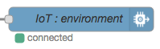{width="1.5586515748031495in"
    height="0.4777777777777778in"}.

3.  This concludes flow 1.

#### ***Flow 2***

1.  The second flow will receive commands that will control the Sense
    Hat LED. In order to build the flow, you will need just four nodes.
    A **Watson IoT** input node will connect to a **function** node,
    which in turn will connect to both a **Sense Hat** output node, and
    a **debug** node. In some space below your first flow, drag these
    nodes into your workspace and connect them as described

2.  Like before, set the debug node to show the **complete msg object**.

3.  The Watson IoT input node will receive the commands that are sent
    from the Bluemix application. You will need to configure the node by
    opening settings and configuring as follows:

    -   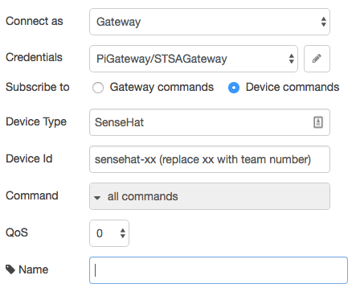{width="3.388888888888889in"
        height="2.814583333333333in"}Again, because we defined the
        Raspberry Pi as a Gateway device, you need to connect as a
        **Gateway**.

-   However, this node is listening for commands that are destined for a
    downstream sensor, not the gateway itself. So, you need to subscribe
    to **Device commands**.

-   Unlike the prior flow, here you will catch **all commands** with a
    single Watson IoT node. In this case, you will still take different
    action based on the command type, but will determine the command
    type by code. You could also do this by using two separate IoT nodes
    (one for each command) like we did with the incoming events, but
    this way you will see that there are many different ways to
    accomplish the same task with Node-Red.

1.  The function node is a powerful node that allows you to incorporate
    your own program logic into a Node-Red application. The message is
    passed in to the function node as a JavaScript object called msg. By
    convention it will have a msg.payload property containing the body
    of the message. You can act on the content of this payload, modify
    it, and pass it along to the next node in your application. The
    function node in this flow will receive the message from the IoT
    service and put it into the format that the Sense Hat expects. The
    commands that come into the Watson IoT node have the following
    format:

> *The “alarm” command*:
>
> msg.command: "alarm"\
> msg.format: "json"\
> msg.deviceType: "SenseHat"\
> msg.deviceId: "sensehat-xx”\
> msg.payload: {d:{color:msg.payload}}
>
> *The “message” command*
>
> msg.command: "message"\
> msg.format: "json"\
> msg.deviceType: "SenseHat"\
> msg.deviceId: "sensehat-xx”\
> msg.payload: {d:{color:"blue",\
> background:"green",\
> message:”message text”}}
>
> In order to set the entire 8x8 Sense Hat LED matrix to a specific
> color, you need to have the following string as the msg.payload:
>
> msg.payload = “\*, \*, *color*” (replacing *color* with a color choice
> like red, blue, green, etc)
>
> To have a message scroll across the LED matrix, the msg format is a
> bit more detailed:
>
> msg.color = “*color*” (again, replacing *color* with a color choice
> like red, blue, green, etc)\
> msg.background = “*color*” (again, replacing *color* with a color
> choice like red, blue, green, etc)\
> msg.payload = “message to display” ***Note:** If the message string is
> only a single character, it will not scroll. Rather, it will stay lit
> on the LED.*
>
> With the knowledge of the contents of the incoming command message as
> well as the requirements of the Sense Hat, a trivial snippet of
> JavaScript code can check for the command type and make the
> transformation. Enter the following code into the function field of
> the function node.
>
> // begin code\
> d = msg.payload.d;\
> \
> if (msg.command == "message") {\
> msg.background = d.background;\
> msg.color = d.color;\
> msg.payload = d.message;\
> }\
> else if (msg.command == "alarm") {\
> msg.payload = "\*,\*," + d.color;\
> }\
> else\
> msg = null;\
> \
> return msg;\
> // end code

1.  With that, the Raspberry Pi side of this application is complete.
    Click on **Deploy** to start the application. Once the Bluemix side
    is complete, you will be able to test the flows and ensure that
    everything is working as expected. Part VII of this workshop has
    some verification tests you can use.

2.  In the end, your Raspberry Pi application should look something like
    this:\
    {width="7.0in" height="3.4791666666666665in"}

Part VII: Deploy and validate success
=====================================

> Once you have completed both the Bluemix and the Raspberry Pi Node-Red
> applications, its time to do some testing to ensure that your
> application is performing as it should be. Future workshops will be
> reliant on the successful execution of this workshop so please check
> that the following items are as expected.
>
> ***Note**: Be sure to deploy the latest version of your applications
> before beginning. If the deploy button is greyed out, then the
> application is already deployed.*

-   In the Bluemix application, use the debug node to verify that all
    message types are being sent to Bluemix (environment, motion,
    joystick). You can do this by clicking the start/stop button on the
    debug node and then looking at the data in the debug tab. For each
    event that comes in, there is an associated eventType. You should be
    able to see the eventType as a part of each message. If you do not,
    you probably do not have the debug node set to display the
    **complete msg object. *Note:*** *You will need to actually move the
    tiny joystick on the Sense Hat in order to see joystick events.*

> 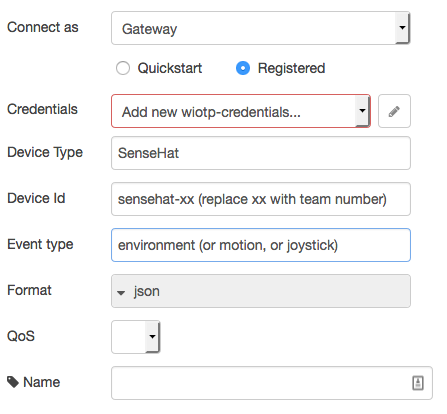{width="4.383660323709536in"
> height="1.5487182852143482in"}

-   In the Bluemix application, use the inject nodes to verify that the
    Sense Hat LED reacts appropriately when you press the inject
    buttons. Be sure that all four injections work properly.

> 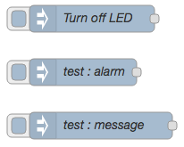{width="1.648918416447944in"
> height="1.3402537182852143in"}
>
> If they do not, check the debug output from the function node that
> formats the data for the Sense Hat. In the output data, you should
> verify that the **eventOrCommandType** is set to the correct command
> type (alarm or message). You should also verify that the **payload**
> looks correct.
>
> For the alarm command, it should look like this:
>
> payload: object\
> d: object\
> color: "navy"
>
> For the message command it should look like this:
>
> payload: object\
> d: object\
> color: "navy"\
> background: "black"

-   Recall earlier that you should have left the **IBM Watson IoT
    Platform Devices** browser tab open. If you switch back to that tab
    now, you should be able to see your newly created device sensehat-xx
    of type SenseHat. As a reminder, you never actually created this
    device or device type. They were created for you by the Raspberry Pi
    gateway. If you did not leave this browser tab open, you can open it
    again from your Bluemix dashboard. If you do not see your new
    device, you may need to press the refresh button.

> 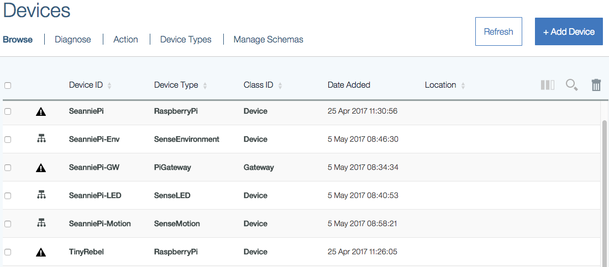{width="4.96875in"
> height="2.1819444444444445in"}

-   Finally, return to your dashDB: Tables browser tab. Once there, if
    you click on Browse Data, you should be able to see the rows of
    environment data being added to your table. If you did not leave
    this browser tab open, you can open it again from your Bluemix
    dashboard.

> 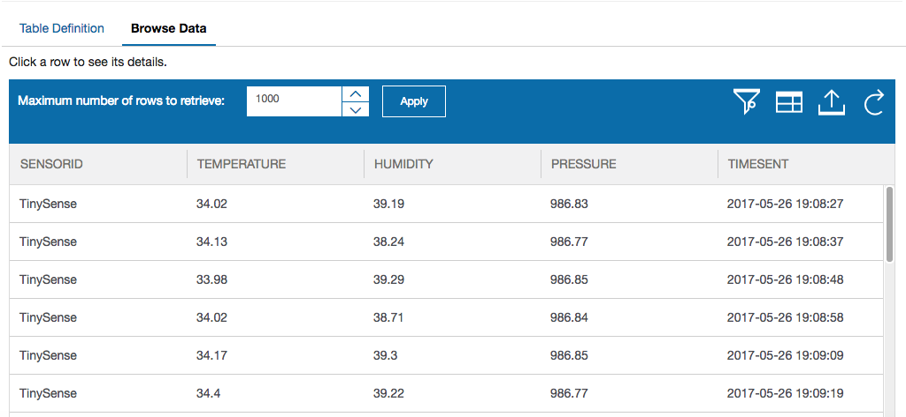{width="4.99375in" height="2.30625in"}

-   If you do not see any data rows in your table, check the debug
    output from the function node that formats the data for dashDB. In
    the output data, you should verify that the **payload** looks like
    this:

> Object\
> SENSORID: "sensehat-xx"\
> TEMPERATURE: 36.34\
> HUMIDITY: 34.74\
> PRESSURE: 991.11\
> TIMESENT: "TIMESTAMP"

Useful Resources:
=================

-   Raspberry Pi:\
    <https://www.raspberrypi.org/>

-   Installing Raspberry Pi Operating Systems:\
    <https://www.raspberrypi.org/downloads/>

-   Node-Red on Raspberry Pi:\
    <https://nodered.org/docs/hardware/raspberrypi.html>

-   Raspberry Pi 3 Raspbian Jessie with WiFi, ssh, headless setup with
    no keyboard or ethernet:\
    <https://caffinc.github.io/2016/12/raspberry-pi-3-headless/>

-   Parts for IoT experimentation:\
    <https://www.adafruit.com>\
    <https://www.sparkfun.com/>\
    <http://www.canakit.com/>

